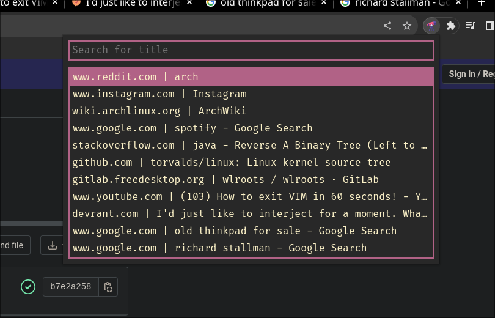

# Telescope for Chrome

### An extension for searching through open tabs



The idea for this extension came from [telescope.nvim](https://github.com/nvim-telescope/telescope.nvim).

## Technologies used:

-   [Svelte](https://svelte.dev/)
-   [TypeScript](https://www.typescriptlang.org/)
-   [Vite](https://vitejs.dev/)
-   [Chrome Extensions Manifest V3](https://developer.chrome.com/docs/extensions/mv3/intro/)

## Development

```bash
# install dependencies
pnpm install

# build extension to the /dist
pnpm run dev
```

## Build

```bash
# build files to `/dist` directory
$ npm run build
```

## Load unpacked extensions

[Getting Started Tutorial](https://developer.chrome.com/docs/extensions/mv3/getstarted/)

1. Open the Extension Management page by navigating to `chrome://extensions`.
2. Enable Developer Mode by clicking the toggle switch next to `Developer mode`.
3. Click the `LOAD UNPACKED` button and select the `/dist` directory.


